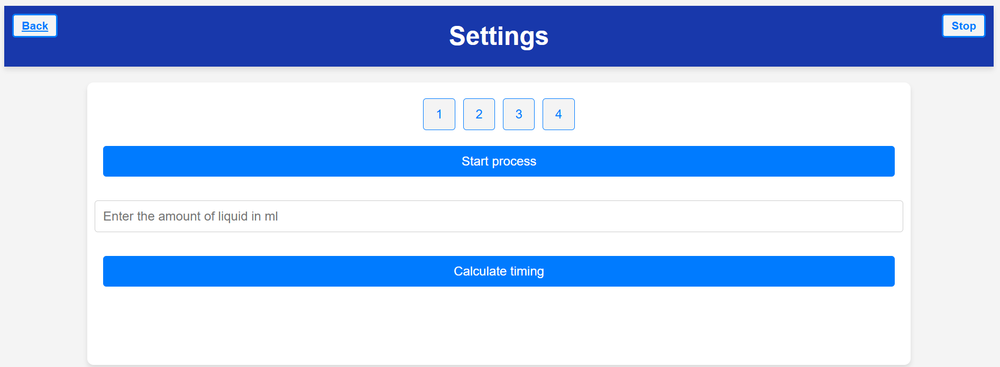
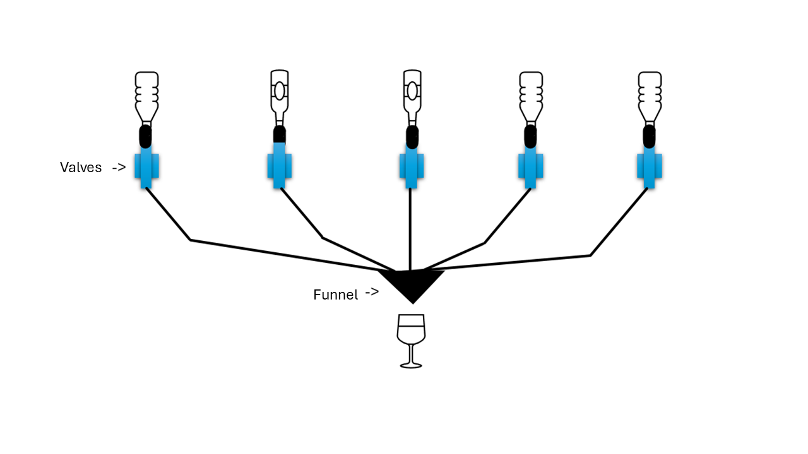
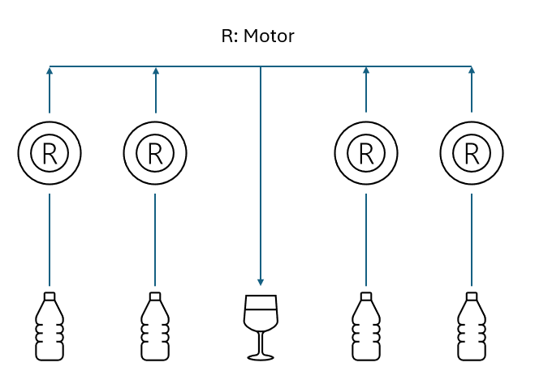
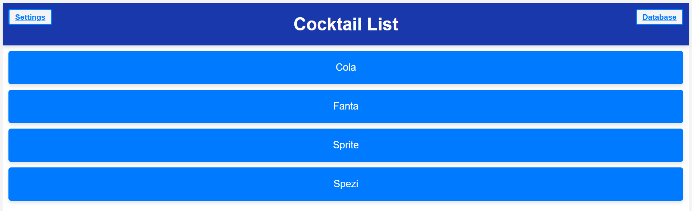
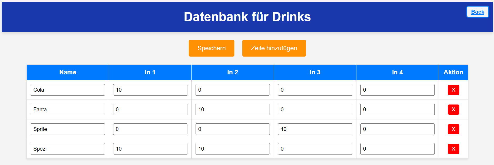
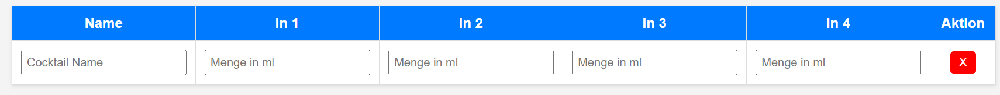
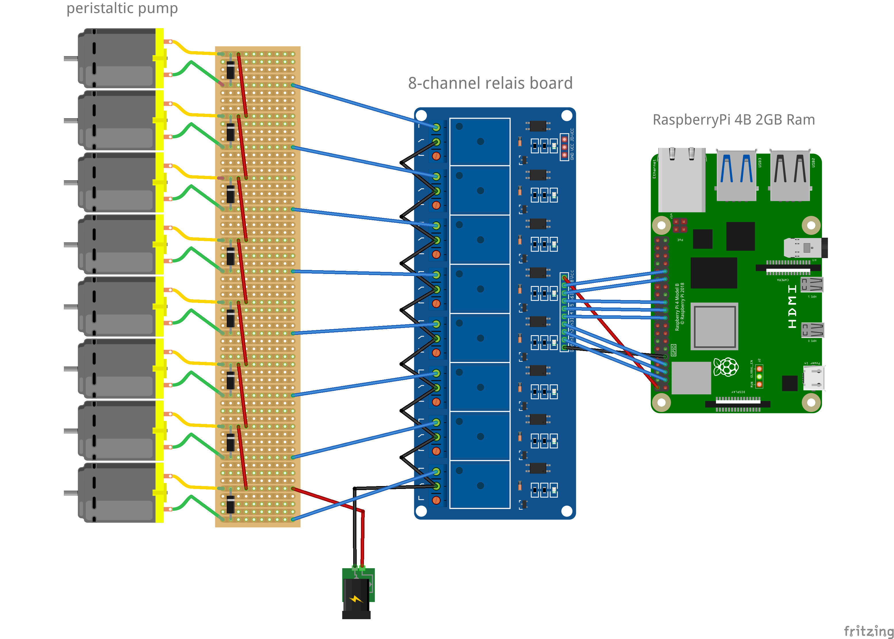
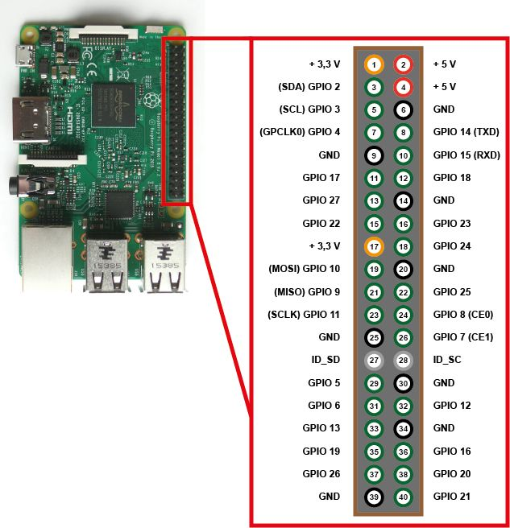

# The Cocktail Machine
 

## Inspiration & Plan
The inspiration for this project came from a spontaneous and amusing idea my friend and I had:  
We want to build a cocktail machine that features multiple bottle inputs and a single output. The goal is to make it as affordable as possible. Instead of using expensive pumps to dispense liquids into the glass, we plan to use valves instead.  

*Here’s our initial design concept: * 


After some changes, we completely redesigned our concept, so instead of using valves, we now use peristalic pumps. The reason for that is the preasure on the tubes when the bottles are full in comparison to them beeing empty. Because of physics the liquid will be going slower the less filled the bottle is.

*Our final design concept:*  


## 1. Website

All cocktails will displayed on the main page, where you can directly choose which cocktail you want to create.


For changing the input values (in ml) you can use the url /database. It's really simple to use. Just type in the name of your drink and how much milliliters you want per Input.



When you create a new line, you'll see what you should write in the input field.


In the /settings tab, there you are able to set up the TPM (time per milliliter). This is very important, so that your machine knows how long the motors should be enabled for the specific amount of liquid.
1. Start the process (Button)
2. Measure the amount of liquid which came out of the output and type it in
3. Calculate the TPM

## 2. Components
The next step is deciding which computer to use for controlling the peristalic morots, ensuring precise amounts of liquid are dispensed into the glas.
For this, you can use a standard microcontroller like an ESP32 or Arduino.  

However, we chose a Raspberry Pi 4 to enable a user-friendly interface. By using your raspberry pi as a webserver and access point at the same time, you can directly connect your phone to the WIFI and go on the website to control the machine.

In addition to the Raspberry Pi, the machine will require:  
- 12 peristalic pumps (maximum)  
- 12 relays to control the valves  
- 10 meters transparent pvc hose (for changing after usage)
- tube connectors

not necessary, but for design ideas:
- LED light pannel
- LED lights

Here is the electronic plan:


\# Picture by: https://github.com/alex9849/CocktailPi

Also the pin assignment uis using the following pins:



| Inputs | GPIO Pin |
|--------|----------|
| 1      |  2       |
| 2      |  3       |
| 3      |  4       |
| 4      | 17       |
| 5      | 27       |
| 6      | 22       |
| 7      | 10       |
| 8      |  9       |
| 9      | 11       |
| 10     |  5       |
| 11     |  6       |
| 12     | 13       |

## 3. Saving all information
There are multiple solutions for saving data with a database. On this project we are using SQLite as our database, but you are totally free to use another one which suits your needs better. Then you just need to adapt the code to your requests.

    -> Install SQLite
    -> Create Databases
    -> Create Script for requests

SQLite database plan:

Recipes Table:
* Recipes Name
* Amout of every Input in ml
<br>=> Name | In1 | In2 | In3 | In4 | ...

1. Programming GUI in Python with Flask / Quart
2. Buying the stuff
3. Building the machine

## 4. Inputs
We have 12 possible Inputs, so you can put your own cocktails in the database and it will automatically use them for the website.

## 5. Database Commands

```sql
DROP TABLE table_name;      -- Delete Table
DELETE FROM table_name;     -- Delete all entries
SELECT * FROM table_name;   -- Show whole Table

.read database/schema.sql   -- Create Table for Cocktails
.schema                     -- Verify Schema
.tables                     -- List Tables
```

## 6. Programming the Valves
After building the website, we need to create functions to control the liquids (Inputs).
We need to create a function to adjust the timing for the right amount of liquid for the glass.

For this purpose I created a Class called [control_rpi.py](website/control_rpi.py) which gives you the ability to easily control the raspberry pi pins of your connected motors.

There is also a test script if you are using your pc to programm and don't have the RPi module loaded. Then you just need to replace the depencency in website.py from "from control_rpi ..." to "from control_rpi_test ..."

For database connection there is a extra script [control_db](website/control_db.py) which can be used to clear the database and fill it with new entrys.

## 7. Changing Programmcode or Style
Just a quick information if you change the [styles.css](website/static/styles.css).  If you do so, please keep in mind that you may have to hard reload your web browser (Strg +  F5 in Chrome). 
This is caused by saving the styles.css file in your browser. Sometimes it won't be loaded again after you visited the website once.

## 8. WiFI Hostspot on Raspberry for connection: See [RPI.md](RPI.md)

## 9. Other ToDos
- DNS Server for website (e.g.: http://cocktail.app/...)